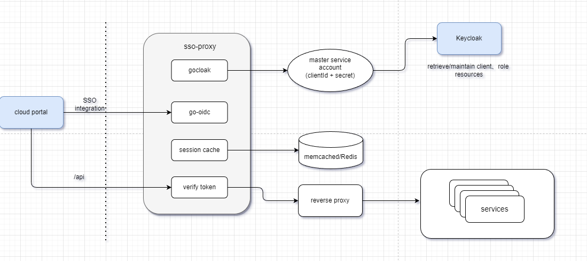

## Architecture



## API
- /auth/
- /proxy/{SERVICE}/
- /internal/**

## 编译可执行文件
+ 在linux环境编译可执行文件
```shell
go build cmd/sso-proxy.go
```

+ 编译其他环境可执行包
```shell
# linux
CGO_ENABLED=0 GOOS=linux GOARCH=amd64 go build cmd/sso-proxy.go

# linux arm
CGO_ENABLED=0 GOOS=linux GOARCH=arm go build cmd/sso-proxy.go

# Mac
CGO_ENABLED=0 GOOS=darwin GOARCH=amd64 go build cmd/sso-proxy.go

# Windows
CGO_ENABLED=0 GOOS=windows GOARCH=amd64 go build move-repository.go

```